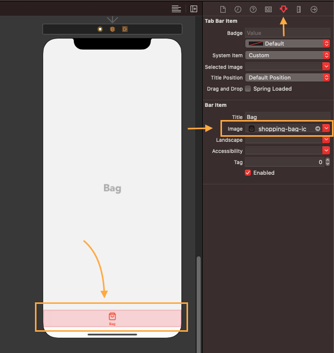

# BookHunterTabBar

     
  

A beautiful TabBar inspired by [Taras Migulko](https://dribbble.com/ui_migulko) [Book Hunter app design](https://dribbble.com/shots/6302734-Book-Hunter-app-design)

   

## Installation
### Swift Package Manager
The Swift Package Manager is a tool for automating the distribution of Swift code and is integrated into the swift compiler.
To integrate using Apple's Swift package manager from xcode :

File -> Swift Packages -> Add Package Dependency... 

enter package URL : https://github.com/kerollesroshdi/BookHunterTabBar.git , choose the latest release

## Usage
#### set UITabBarController class to BookHunterTabBarController
 

#### set UITabBarController color and images attributes 
 

#### link 5 UIViewControllers to the tabbar and set the UITabBarItem image
it only support exactly five(5) UIViewController (2 on the sides and 3 around the middle button)
 

## Licence
BookHunterTabBar is released under an MIT license. See [License](https://github.com/kerollesroshdi/BookHunterTabBar/blob/master/LICENSE) for more information.
